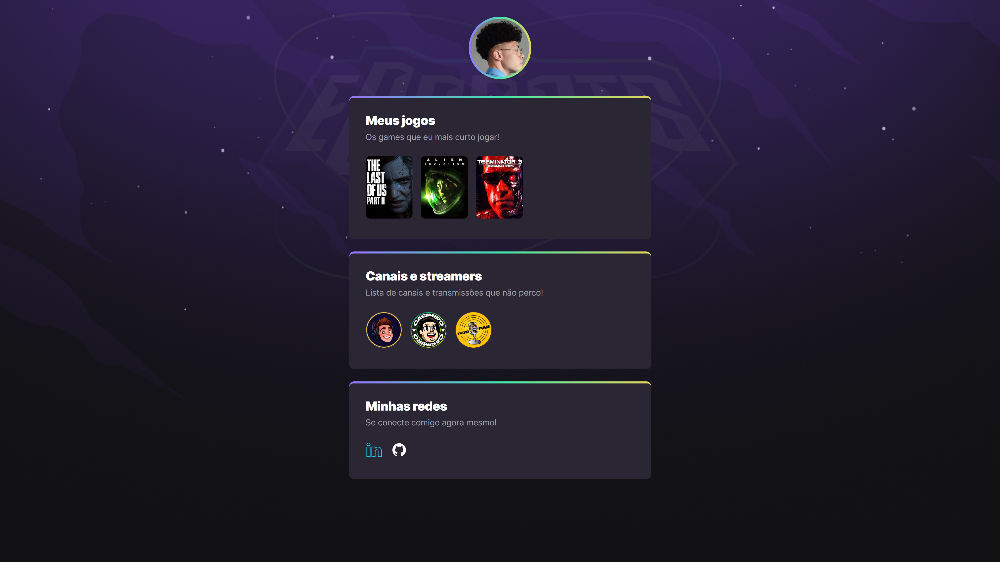

# NLW eSports

> Trilha Explorer

Projeto construído durante o evento Next Level Week da Rocketseat.

[🔗 Clique aqui para acessar](https://igorlrlnlwesports2022.netlify.app/)

## 🛠 Tecnologias

- HTML
- CSS
- GIT
- GitHub
- Netlify

Obs: durante o evento foi recomendado o uso do GitHub também para a hospedagem do site, mas preferi usar o Netlify pois já havia usado anteriormente para outro projeto.

## 💬 Contato

Likedin: https://www.linkedin.com/in/igor-leandro-5a22531a2/